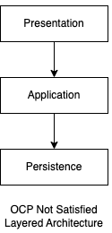
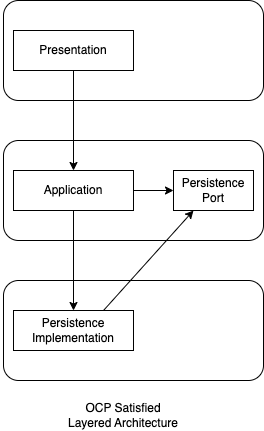

# Layered (계층형) 아키텍처

Layered 아키텍처는 웹서비스 개발 시 가장 널리 쓰이며 역할에 따라 여러 레이어로 구성되는 특징이 있다.
* Presentation 레이어 : 클라이언트에 상호작용을 위한 View를 제공하고 API 요청을 처리한다.
* Application 레이어 : Persistence, 기타 서비스 등에 의존하고 비즈니스의 흐름을 제어한다.
* Persistence 레이어 : DB에 접근하여 영구적으로 데이터를 쓰고 읽는 각종 인터페이스를 제공한다.

Layered 아키텍처는 의존성의 방향이 위에서 아래로의 한 방향으로만 흘러가므로 구현 난이도가 쉬운 것이 장점이지만 객체지향적인 측면에서 조금 부족할 수 있다. 
글을 진행하기에 앞서 용어가 혼동될 수 있는데 Application == api, Persistence == domain-jpa 라고 대략 이해하면서 읽어주시면 충분할듯 하다.  🙇‍🙇‍️

## Layered 아키텍처


위 아키텍처 그림을 보면 Application 레이어는 Persistence 레이어에 의존한다. 즉 Application은 Persistence의 구체적인 구현에 의존한다. 물론 Persistence 레이어에서 인터페이스를 정의하고 그 인터페이스에 의존시켜 DIP를 만족시킬 수는 있지만 Persistence의 인터페이스가 변경될 때마다 Application 레이어도 변경될 수 있어 OCP를 만족시키지 못한다.

준비해둔 코드 샘플을 보자.

### 모듈 구성
* [layered-api](layered-api%2Fsrc%2Fmain%2Fkotlin%2Fcom%2Ftraeper%2Fmsa%2Flayered%2Fapi) : Presentation, Application 레이어를 갖는 모듈
* [layered-domain-jpa](layered-domain-jpa%2Fsrc%2Fmain%2Fkotlin%2Fcom%2Ftraeper%2Fmsa%2Flayered%2Fdomain%2Fjpa) : Persistence 레이어 모듈이며 JPA의 구체적인 기술에 의존하는 모듈 

### DIP를 만족하지만 OCP는 만족하지 않는 예시

layered-api의 [CarMarketService 코드](layered-api%2Fsrc%2Fmain%2Fkotlin%2Fcom%2Ftraeper%2Fmsa%2Flayered%2Fapi%2Fapplication%2FCarMarketService.kt)를 보자.
```kotlin
package com.traeper.msa.layered.api.application

/* .. */
import com.traeper.msa.layered.domain.jpa.car.port.CarDomainService

@Service
class CarMarketService(
    private val carDomainService: CarDomainService,
) {
    fun getCar(carId: Long): CarResponse =
        carDomainService.getCar(carId)
            .toCarResponse()
}

private fun Car.toCarResponse(): CarResponse =
    CarResponse(this.corpName, this.modelName)
```

DB에 접근하는 부분을 [CarDomainService 인터페이스](layered-domain-jpa%2Fsrc%2Fmain%2Fkotlin%2Fcom%2Ftraeper%2Fmsa%2Flayered%2Fdomain%2Fjpa%2Fcar%2Fport%2FCarDomainService.kt)에 의존하므로 JPA와 같은 구체적인 기술에 의존하지 않는 것을 볼 수 있다. 그렇지만 import 문을 보면 알 수 있듯 jpa라는 단어가 조금 거슬린다. 기술에 대한 의존성도 함께 가지고 있는데 과연 OCP를 만족시킬 수 있을까? 

```kotlin
// CarDomainService 인터페이스
package com.traeper.msa.layered.api.domain.port.car

interface CarDomainService {
    fun getCar(carId: Long): Car
}

// CarDomainServiceImpl 구현체
package com.traeper.msa.layered.domain.jpa.car

@Component
class CarDomainServiceImpl(
    val repository: CarMarketRepository,
) : CarDomainService {
    override fun getCar(carId: Long): Car =
        repository.findByIdOrNull(carId)!!.toCar()
}

private fun CarEntity.toCar(): Car =
    Car(
        corpName = this.corpName,
        modelName = this.modelName,
    )
```

모듈 단위에서 보면 여전히 api는 domain-jpa가 변경될 때마다 직접적인 영향을 받는다. domain 모듈에서 인터페이스를 제공해서 DIP를 만족시키더라도 결국 상위 레이어인 api 모듈 입장에선 저수준의 인터페이스에 종속되는 것이므로 OCP에 위배된다. 

### OCP를 만족시키지 못하는 구체적인 이유
* JPA의 특정 스펙이 변경되어 인터페이스가 변경되는 경우, 상위 api 모듈의 코드도 변경되어야 한다.
* JPA가 아닌 다른 기술을 이용한 모듈을 새로 개발해야 하는 경우, 상위 api 모듈에서도 새로운 인터페이스를 참조하도록 변경해야 하며 Persistence 레이어 간 인터페이스가 중복으로 존재하게 되는 단점이 추가로 생긴다. 

이런 문제들이 생겨나는 이유를 쉽게 설명해보자면 갑(api)과 을(domain-jpa)이 있다고 칠 때, 을의 변경에 갑이 영향을 받는 이상한 모양이 되기 때문이다. 을이 변하더라도 갑은 변하지 않는 즉 수정에 닫히는 방식으로 개발을 하는게 좋겠다. OCP를 만족시키려면 어떻게 해야할까? 
 
## OCP를 만족하는 Layered 아키텍처
OCP의 핵심은 상위 모듈이 하위 모듈의 변경에 대해 자유로워야 한다는 것인데 구현 방법은 생각보다 간단하다. 하위 모듈의 인터페이스를 상위 모듈의 **요구사항 명세**를 담는 별도의 인터페이스 전용 모듈로 추출하면 되는 것이다. 



위는 OCP를 충족시키는 아키텍처이다. 기존 layered 아키텍처와 다르게 Persistence Port 인터페이스 모듈을 Application 레이어에 추가하였다.
Application은 Persistence Port 모듈에 자신의 요구사항을 명시하고 의존한다. Persistence는 해당 인터페이스를 구현하며 실행시간에 빈을 제공하도록 한다.

### 모듈 구성
* [ocp-layered-api](ocp-layered-api%2Fsrc%2Fmain%2Fkotlin%2Fcom%2Ftraeper%2Fmsa%2Flayered%2Fapi) : Presentation, Application 레이어를 갖는 모듈, 기존 layered 구조와 거의 차이가 없다.
* [ocp-layered-api-domain-port](ocp-layered-api-domain-port%2Fsrc%2Fmain%2Fkotlin%2Fcom%2Ftraeper%2Fmsa%2Flayered%2Fapi%2Fdomain%2Fport) : Persistence Port 모듈이며 Application이 Persistence 레이어에 원하는 요구사항을 명세한 인터페이스 모듈
* [ocp-layered-domain-jpa](ocp-layered-domain-jpa%2Fsrc%2Fmain%2Fkotlin%2Fcom%2Ftraeper%2Fmsa%2Flayered%2Fdomain%2Fjpa) : Persistence 레이어 모듈이며 Persistence Port의 인터페이스를 따르는 JPA의 구현체를 작성하는 모듈

모듈 구성을 보면 ocp-layered-api-domain-port이 추가된 것을 볼 수 있다. Application이 Persistence 레이어에 원하는 요구사항을 명세한 인터페이스 모듈이라고 이해하면 된다. 갑(api)의 요구사항을 명시하고 을(domain-jpa)이 요구사항을 충실히 구현하는 방향으로 이해하자.

### DIP 뿐만 아니라 OCP를 만족하는 Layered 아키텍처

ocp-layered-api의 [CarMarketService 코드](ocp-layered-api%2Fsrc%2Fmain%2Fkotlin%2Fcom%2Ftraeper%2Fmsa%2Flayered%2Fapi%2Fapplication%2FCarMarketService.kt)를 보자.
```kotlin
package com.traeper.msa.layered.api.application

/* .. */
import com.traeper.msa.layered.api.domain.port.car.CarDomainService

@Service
class CarMarketService(
    private val carDomainService: CarDomainService,
) {
    fun getCar(carId: Long): CarResponse =
        carDomainService.getCar(carId).toCarResponse()
}

private fun Car.toCarResponse(): CarResponse =
    CarResponse(this.corpName, this.modelName)
```

별도의 모듈로 추출한 [CarDomainService 인터페이스](layered-domain-jpa%2Fsrc%2Fmain%2Fkotlin%2Fcom%2Ftraeper%2Fmsa%2Flayered%2Fdomain%2Fjpa%2Fcar%2Fport%2FCarDomainService.kt)에 의존하는 것을 볼 수 있다. 여기까지 봐서는 OCP를 만족시키지 못하는 예제와 다를 것이 거의 없어보이지만 이미 차이는 생겼다. import를 보면 jpa가 더는 보이지 않으므로 구체적인 기술에 의존하지 않는 방향으로 추상화가 되었음을 알 수 있다.  

```kotlin
// ocp-layered-api-domain-port의 CarDomainService 인터페이스
package com.traeper.msa.layered.api.domain.port.car

interface CarDomainService {
    fun getCar(carId: Long): Car
}

// ocp-layered-domain-jpa의 CarDomainServiceImpl 구현체
package com.traeper.msa.layered.domain.jpa.car

@Component
class CarDomainServiceImpl(
    val repository: CarMarketRepository,
) : CarDomainService {
    override fun getCar(carId: Long): Car =
        repository.findByIdOrNull(carId)!!.toCar()
}

private fun CarEntity.toCar(): Car =
    Car(
        corpName = this.corpName,
        modelName = this.modelName,
    )
```

CarDomainService와 CarDomainServiceImpl이 서로 다른 모듈에 위치하는 것을 볼 수 있다. 이젠 CarDomainService에 대해 JPA가 아닌 다른 구현체를 추가하더라도 독립적인 인터페이스 전용 모듈에 의존하고 있으므로 api 모듈에서 수정이 발생할 확률이 줄었다고 볼 수 있다.
api 모듈은 컴파일 시간에는 인터페이스에 의존하고 실행 시간에는 구현체의 빈에 의존하여 작동하게 된다.

물론 이렇게만 작성한다고 자동으로 OCP가 100% 충족이 되는 것은 아니다. 인터페이스가 특정 기술이나 구현체에 종속적으로 변하지 않도록 갑(api)의 입장에서 인터페이스를 바라보고 오염되지 않도록 경계하는 습관을 가져야 한다.

## 요약
* JPA, Redis, 기타 시스템 등 구체적인 기술이나 스펙에 구체적으로 의존하는 모듈이 있다면 인터페이스는 외부에 전용 모듈로 추출하고 기술보단 서비스의 요구사항을 담도록 노력하자. 
* 위 말이 어렵다면 인터페이스는 갑(api)의 입장에서 작성하고 을(domain-jpa)은 철저히 따르도록 구현하는 것을 기억하자.